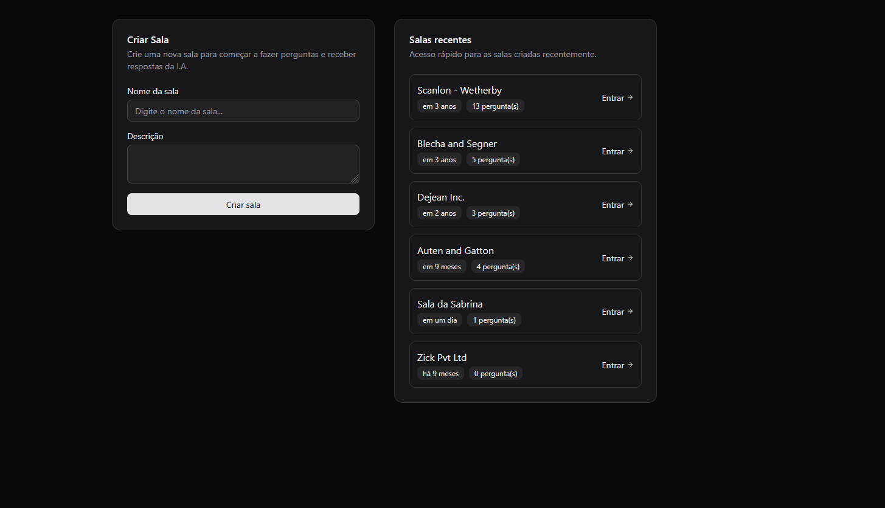
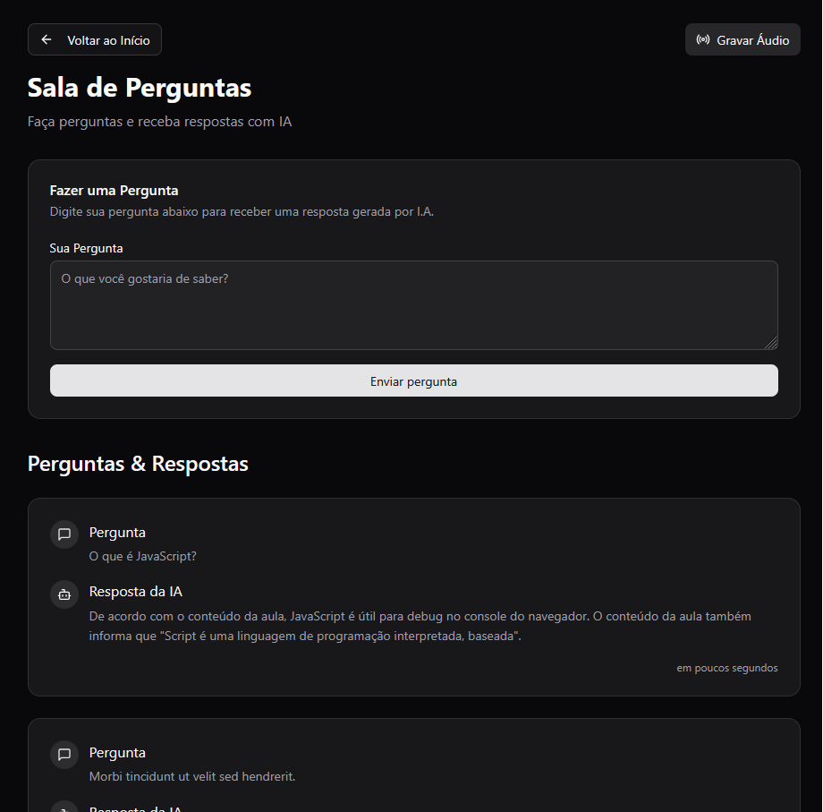
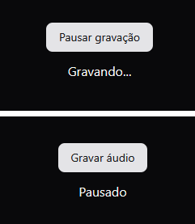

# 🚀 Let me Ask - Web/Frontend

Este repositório representa o frontend do projeto desenvolvido durante a Trilha Intermediária do **NLW Agents** da Rocketseat.
A proposta foi reconstruir o clássico **Let me Ask**, uma aplicação pensada para lives e transmissões, onde o público pode enviar perguntas e o apresentador pode gerenciar todas elas em tempo real.
Mas aqui, o projeto ganhou um superpoder: a integração com um Agente de I.A., capaz de responder automaticamente as perguntas recebidas, tornando a interação com a audiência muito mais dinâmica.
Além disso, é possível criar novas salas personalizadas, permitindo que diferentes eventos, temas ou transmissões tenham seus próprios espaços para perguntas e respostas.

---

## ✨ Funcionalidades

- Criação de salas
- Envio de perguntas de texto
- Gravação de áudio direto do navegador
- Envio automático de trechos de áudio
- Respostas geradas por IA
- Interface com feedback em tempo real

---

## 🛠️ Tecnologias Utilizadas

- **React 19.1** – Biblioteca para interfaces de usuário  
- **TypeScript 5.8** – Superset do JavaScript com tipagem estática  
- **Vite 7.0** – Ferramenta de build e servidor de desenvolvimento rápido  
- **TailwindCSS 4.1** – Framework CSS utility-first para estilização  
- **React Router Dom 7.6** – Gerenciamento de rotas e navegação  
- **TanStack React Query 5.8** – Gerenciamento de dados assíncronos e cache  
- **Radix UI** – Componentes acessíveis e base para construção de UI  
- **Shadcn/ui** – Biblioteca de componentes estilizados com Tailwind  
- **Lucide React** – Coleção de ícones SVG para React

---

## ⚡ Como rodar o projeto

1. **Clone o repositório**
   ```sh
   git clone https://github.com/sahAlves/nlw-agents-intermediario-web.git
   cd nlw-agents-intermediario-web
   ```

2. **Instale as dependências**
   ```sh
   npm install
   ```

3. **Inicie o servidor de desenvolvimento**
   ```sh
   npm run dev
   ```

4. **Acesse:**  
   [http://localhost:5173](http://localhost:5173) (ou a porta exibida no terminal)

---

## 📸 Interface

### Página Inicial


### Sala com suas perguntas


### Sala de Gravação


### Respostas


---

## 💡 Observações

- Certifique-se de que o backend (API) esteja rodando em `http://localhost:3333` para o funcionamento completo.
- Projeto desenvolvido durante o **NLW Agents** da Rocketseat.